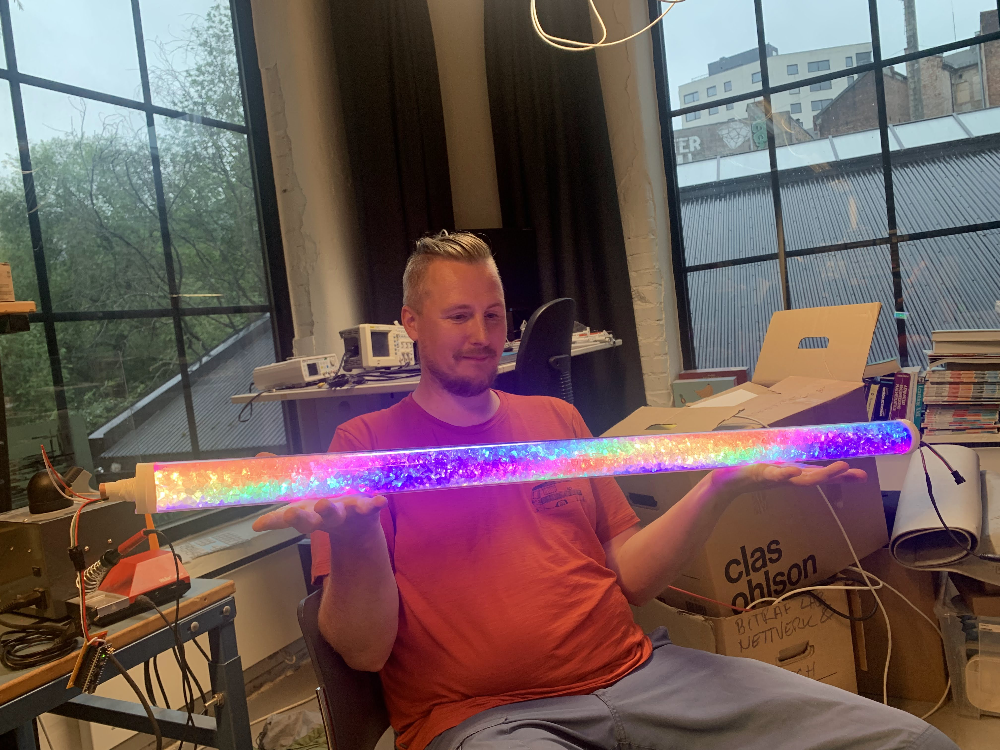

# Dancing_lights
Dancing lights is an interactive sensitive light installation where 300 programmable LEDs in a tube filled with crushed glass responds to rythmic movement.

## Status and todos
*Under development*
* Sensor needs more testing (select / build mega resistor?)
* Need to design and fabricate a base
* Add models from fusion
* Design fan mount (postponed)

## Principles and inspiration
* The glass shard filled LED diffusor tube is inspired by [Invento3Ds Instructable: Glass Stone LED Tube](https://www.instructables.com/Glass-Stone-LED-Tube-WiFi-Controlled-Through-Smart/)
* The motion sensor is based on Capacitive touch [Arduino playground: Capacitive Sensing Library
 by Paul Badger](https://playground.arduino.cc/Main/CapacitiveSensor/) and [My own lesson material on pulldown and EMC noise](https://github.com/KubenKoder/Arduino/tree/master/Egna%20exempel/pulldown)
* It uses the Arduino [FastLED library](https://fastled.io/) to make the pretty light patterns

## Bill of Materials
Purchased in or imported to Norway. NOK = Norwegian kroner.

* 300 WS2812B GRB LEDs on a 5 m tape strip IP30 5V (60/m). WS2812B GRB ~$10 from [Aliexpress](https://www.aliexpress.com/item/32682015405.html) 
* 1m Ø50 mm Acrylic tube 383 NOK from [Sløjd-Detaljer](https://www.sloyd-detaljer.no/produkter/tre-metallsloyd/plast-gummi/ror-stenger/akrylror-1757)
* Used 2 kg 4-10 mm size crushed glass, 175 NOK for 3 Kg from [My stone](https://mystonebrukskunst.no/dekorasjonsglass)
* 3D-printed endcaps for the tube, modeled in Fusion360 [STL](models/50mm_plug.stl) Printed for free on a Pruse at [Bitraf makerspace](https://bitraf.no/)
* Copper tube, Ø15mm wall thickness 1.5mm, Recyled scrap. 
* 2 5V 8A Power bricks, ~10$ each from [Aliexpress](https://www.aliexpress.com/item/32986101102.html)
* 3 pin connector cheap from [Aliexpress](https://www.aliexpress.com/item/32920894203.html)
* 2 pin barrel jack connector cheap from [Aliexpress](https://www.aliexpress.com/item/32966940042.html)
* Base material TBD
* Vero-board
* Capacitors
* Antenna (FIA 137 47-68MHz, 87,5-104MHz or 174-230MHz depending on expended length) from flea market

