# Dancing_lights
Dancing lights is an interactive sensitive light installation where 180 (was 300) programmable LEDs in a tube filled with crushed glass responds to movement by sensing the induced voltage from static electricity stored in people into an old TV antenna.

[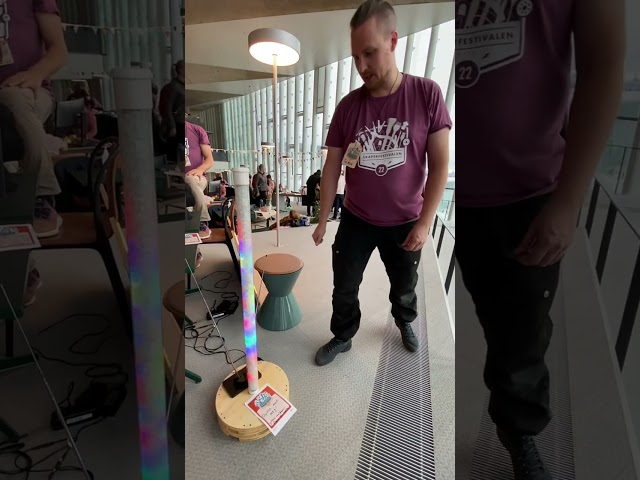](https://youtube.com/shorts/MSAI1wNTsRs)

[Video demo from Oslo skaperfestival 2022 at Deichman library](https://youtube.com/shorts/MSAI1wNTsRs)

[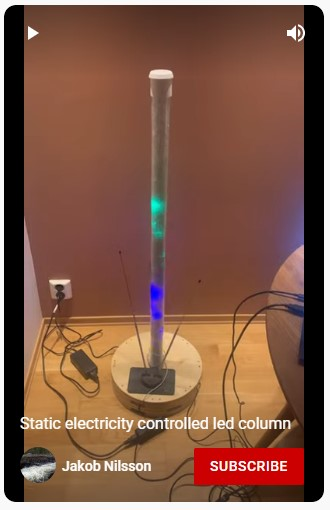](https://youtube.com/shorts/0vz_sim-DHY?feature=share)

[Youtube short showing basic functions, no audio](https://youtube.com/shorts/0vz_sim-DHY?feature=share)

## Status and todos

[Current code](code/FirstLight_dual_sensor/FirstLight_dual_sensor.ino)

120 of 300 LEDs are currently not working since I accidentally pulled off a solder-pad. Will probably have to empty it of glass to fix. The problem is in the top.

To filter away noise the arduino ground has to be connected to ground via a capacitor (type Y). I currently solve this by using an extra power brick for a Thinkpad laptop that happens to have one built in.

The long wire for the antennae is acting like an antenna as well and merges the signals.

Right now it flickers quite a bit, I should look into altering the code to reduce that. (Perhaps blur or filter harder?)

## Principles and inspiration
* The glass shard filled LED diffusor tube is inspired by [Invento3Ds Instructable: Glass Stone LED Tube](https://www.instructables.com/Glass-Stone-LED-Tube-WiFi-Controlled-Through-Smart/)
* The motion sensor is based on Capacitive touch [Arduino playground: Capacitive Sensing Library
 by Paul Badger](https://playground.arduino.cc/Main/CapacitiveSensor/) and [My own lesson material on pulldown and EMC noise](https://github.com/KubenKoder/Arduino/tree/master/Egna%20exempel/pulldown)
* It uses the Arduino [FastLED library](https://fastled.io/) to make the pretty light patterns and [Scott Marleys youtube videos were priceless](https://youtube.com/playlist?list=PLgXkGn3BBAGi5dTOCuEwrLuFtfz0kGFTC) 

## Bill of Materials
Purchased in or imported to Norway. NOK = Norwegian kroner.

* 300 WS2812B GRB LEDs on a 5 m tape strip IP30 5V (60/m). WS2812B GRB ~$10 from [Aliexpress](https://www.aliexpress.com/item/32682015405.html) 
* 1m Ø50 mm Acrylic tube 383 NOK from [Sløjd-Detaljer](https://www.sloyd-detaljer.no/produkter/tre-metallsloyd/plast-gummi/ror-stenger/akrylror-1757)
* Used 2 kg 4-10 mm size crushed glass, 175 NOK for 3 Kg from [My stone](https://mystonebrukskunst.no/dekorasjonsglass)
* 3D-printed endcaps for the tube, modeled in Fusion360 [STL](models/50mm_plug.stl) Printed for free on a Pruse at [Bitraf makerspace](https://bitraf.no/)
* Copper tube, Ø15mm wall thickness 1.5mm, Recyled scrap. 
* 2 5V 8A Power bricks, ~10$ each from [Aliexpress](https://www.aliexpress.com/item/32986101102.html)
* 3 pin connector cheap from [Aliexpress](https://www.aliexpress.com/item/32920894203.html)
* 2 pin barrel jack connector cheap from [Aliexpress](https://www.aliexpress.com/item/32966940042.html)
* Base material TBD
* Vero-board
* Capacitors
* Antenna from flea market (According to its manual it's a FIA 137 47-68MHz, 87,5-104MHz or 174-230MHz depending on expended length but I doubt it matters in my case.) 

## Components
### 5x1m LED strips mounted on Ø15mm copper tube
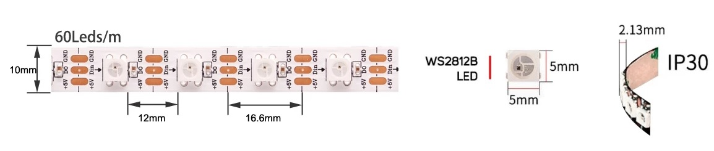

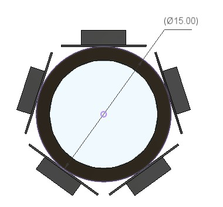

Diameter 15mm => cicumference 47mm, 5 strips that are 10mm wide should not work in theory but works in practice since the edges don't follow the curve of the tube perfectly.
The tape attatches well to the tube. Didn't feel there was need to secure it further.

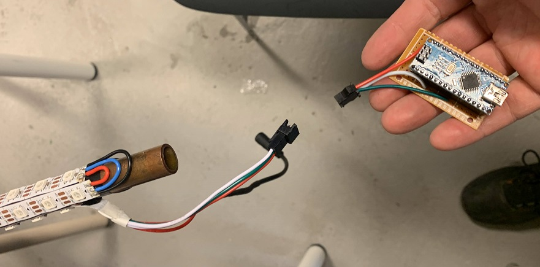

Note that I staggered the ends of the strips. They are soldered together like as if they still were one long strip.

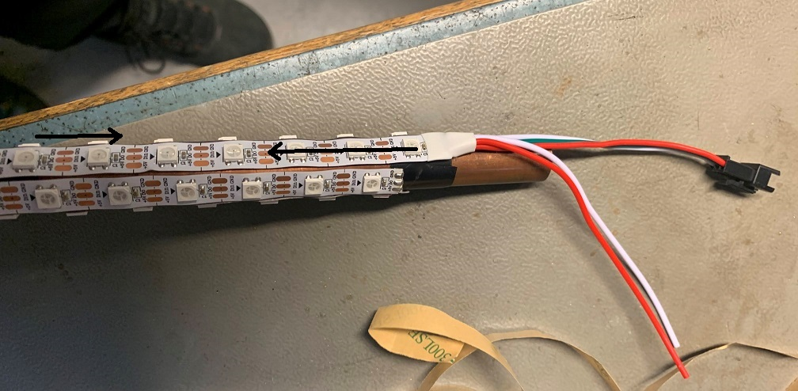

Default configuration for the LED coordinates.

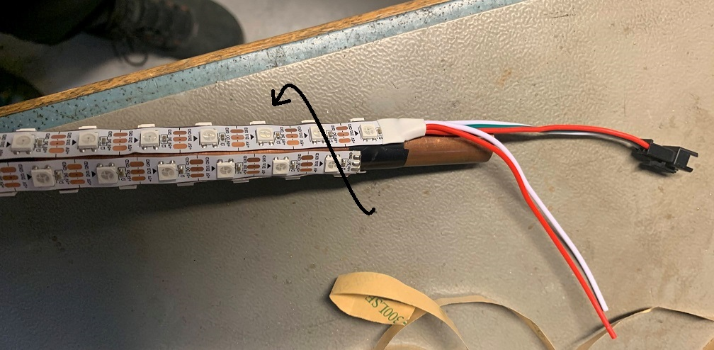

Alternative LED coordinates increases the axial resolution from 60 leds / m to 300 leds / m. 

### Schematic

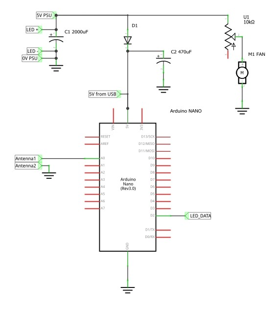

[Schematic pdf](Schematic.pdf)

[Schematic frizing](Schematic_fritzing.fzz)

### 3D models

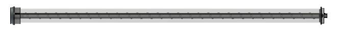

[Fusion model (online view, can be downloaded)](https://a360.co/3SHoL3g) 

[STEP file (right click and "save link as" or it will open as text](models/LED-tube_v21.step)

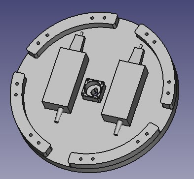

[Freecad file](models/main_shape.FCStd)

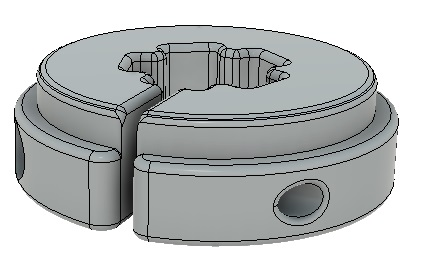

[STL file](models/50mm_plug.stl)

The idea is to clamp the copper tube tight so that any load on the acrylic tube is transfered to the copper via the endcaps and not via the LEDs. I also want it to cover the ends of the led strips.

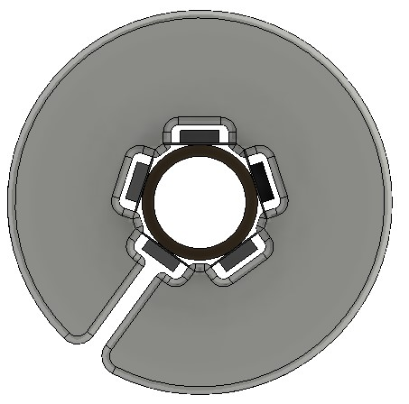

Didn't fit very well. Had to file off some plastic to get it over the edges of the LED_strip tape and since I did it didn't clamp as well. Compensated with white electricans tape. I consider adding metal hose clamps.

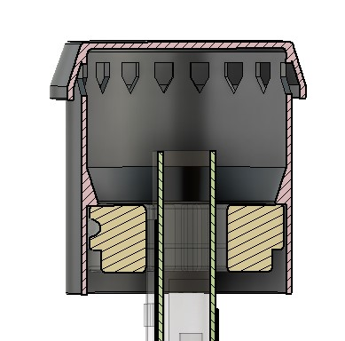

Concept of a top cap to hide the end and allow airflow through the pipe. Allows space for a large capacitor inside the cap, for the end of the strip. 

[STL file](models/top_cap.stl)

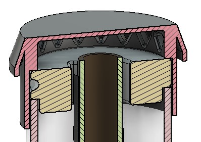

Slim version of top cap to hide the end and allow airflow through the pipe. Requires trimming the copper pipe tight to the plastic clamp. No space for capacitor here, needs to be attached to the other ends of the strips.

[STL file](models/top_cap_slim.stl)

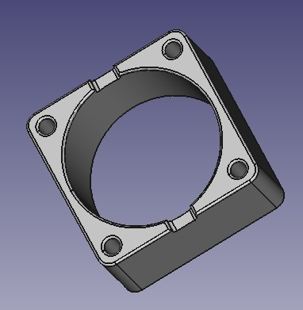

Fan mount for bottom 

[STL file](models/fan_holder_bottom.stl)

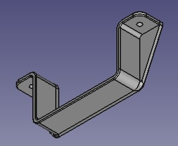

For holding the power bricks in place.

[STL file](models/brick_holder.stl)

## Code 

[Current code using both antennas](code/FirstLight_dual_sensor/FirstLight_dual_sensor.ino)
  
"Pacifica" and "Fire2012" are also nice when copied around the column. 

### Ideas of features to code:

#### Smooth movement between pixels
I observe that moving the leds along a full step at a time isn't very smooth. As in if I turn the next led on 100% as I turn the last to 0%. Some X-fading would be much better. Perhaps I can increase the pixel resolution articficially and spread the light between two pixels proportionally, like anti-aliasing?

#### Reduce flicker
Perhaps I can use blur or smoothe harder?

#### Beat reaction
I have not started on the code for a beat-sensor like I had intended. I have a basic idea but no code yet.
If I smoothe the same signal differently hard and compare when they cross I should be able to track a frequency. I can track amplitude also if needed but should wait with it.
I have no ready plan for what to show if I mananage to track the beat. Figure that out first?
